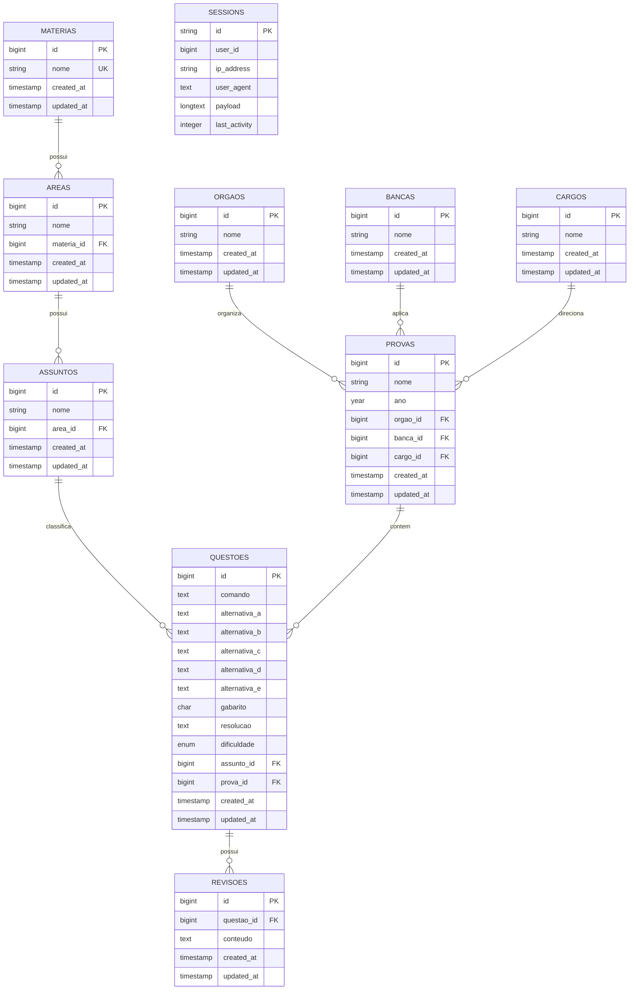

# Inicialização do Projeto

Este projeto utiliza o **Laravel** como servidor HTTP e backend, enquanto a interface da aplicação é desenvolvida com o **Lotus**, um framework próprio escrito em JavaScript puro.

O Laravel é responsável pelo servidor, rotas, APIs, banco de dados e recursos de backend. O Lotus é carregado diretamente pelo navegador a partir da pasta `public/APP` e controla a interface, componentes, navegação e Virtual DOM no cliente.

---

# Pré-requisitos

Antes de iniciar, instale:

* PHP 8.3 ou superior
* Composer
* Node.js 20 ou superior
* NPM
* Extensão PHP SQLite habilitada (`pdo_sqlite` e `sqlite3`)

Por padrão, o projeto usa **SQLite**. Não é necessário iniciar MySQL para rodar localmente com a configuração padrão do `.env.example`.

---

# Instalação

Clone o repositório:

```bash
git clone git@github.com:ThiagoAlexandreGuerra/projetoOMonitor.git
```

Entre na pasta da API:

```bash
cd projetoOMonitor/Omonitor_versaoPreAlfa/API
```

Instale as dependências do Laravel:

```bash
composer install
```

Instale as dependências JavaScript:

```bash
npm install
```

Crie o arquivo de ambiente:

```bash
cp .env.example .env
```

No Windows:

```bash
copy .env.example .env
```

Gere a chave da aplicação:

```bash
php artisan key:generate
```

---

# Inicialização do banco de dados

O `.env.example` já vem configurado para SQLite:

```env
DB_CONNECTION=sqlite
SESSION_DRIVER=database
QUEUE_CONNECTION=database
CACHE_STORE=database
```

Crie o arquivo do banco:

```bash
touch database/database.sqlite
```

No Windows PowerShell:

```powershell
New-Item -ItemType File -Path database/database.sqlite -Force
```

Execute as migrations:

```bash
php artisan migrate
```

Esse passo cria as tabelas da aplicação e também a tabela `sessions`, necessária porque o projeto usa `SESSION_DRIVER=database`.

Se o projeto tiver seeders para dados iniciais, execute:

```bash
php artisan db:seed
```

---

# Diagrama do banco de dados



---

# Rodando o app

Inicie o servidor Laravel:

```bash
php artisan serve
```

A aplicação ficará disponível em:

```text
http://127.0.0.1:8000
```

Abra esse endereço no navegador.

---

# Fluxo rápido

Depois de clonar o projeto, o fluxo completo para rodar localmente é:

```bash
cd projetoOMonitor/Omonitor_versaoPreAlfa/API
composer install
npm install
cp .env.example .env
php artisan key:generate
touch database/database.sqlite
php artisan migrate
php artisan serve
```

No Windows, troque `cp` por `copy` e `touch` por:

```powershell
New-Item -ItemType File -Path database/database.sqlite -Force
```

---

# Estrutura do projeto

```text
app/
bootstrap/
config/
database/
public/
├── APP/
│   ├── globalStyle/
│   ├── src/
│   │   ├── core/
│   │   ├── pages/
│   │   └── ...
│   └── manifest.webmanifest
resources/
routes/
storage/
```

---

# Como funciona

O Laravel renderiza a view principal:

```text
resources/views/index.blade.php
```

Essa view carrega o ponto de entrada do Lotus:

```html
<script type="module" src="./APP/src/core/main/main.js"></script>
```

A partir desse arquivo, o Lotus inicializa a navegação, o Virtual DOM e os componentes da aplicação.

---

# Desenvolvimento

Os arquivos principais da interface ficam em:

```text
public/APP
```

Como o Lotus usa módulos ES (`import` e `export`) diretamente no navegador, normalmente não é necessário compilar o frontend para desenvolver a interface.

Depois de alterar arquivos JavaScript ou CSS em `public/APP`, atualize a página no navegador.

Se a página continuar exibindo uma versão antiga, faça um hard refresh:

```text
Ctrl+Shift+R
```

O projeto registra um service worker em `public/APP/serviceWorker.js`. Se o navegador mantiver arquivos antigos em cache, remova o service worker nas ferramentas de desenvolvedor do navegador e recarregue a página.

---

# Backend

As APIs devem ser criadas com os recursos padrão do Laravel:

```text
routes/api.php
app/Http/Controllers
app/Models
```

O Lotus pode consumir essas APIs usando `fetch()` ou qualquer camada de comunicação implementada no framework.

---

# Comandos úteis

Limpar caches do Laravel:

```bash
php artisan optimize:clear
```

Verificar migrations:

```bash
php artisan migrate:status
```

Rodar testes, se existirem:

```bash
php artisan test
```

---

# Observações

* O banco local padrão é `database/database.sqlite`.
* O arquivo `.env` não deve ser versionado.
* Alterações no backend podem exigir reiniciar `php artisan serve`.
* Alterações no frontend geralmente exigem apenas atualizar a página.
* Em Linux, caminhos de import JavaScript diferenciam maiúsculas e minúsculas. O nome importado precisa bater exatamente com o nome do arquivo.
