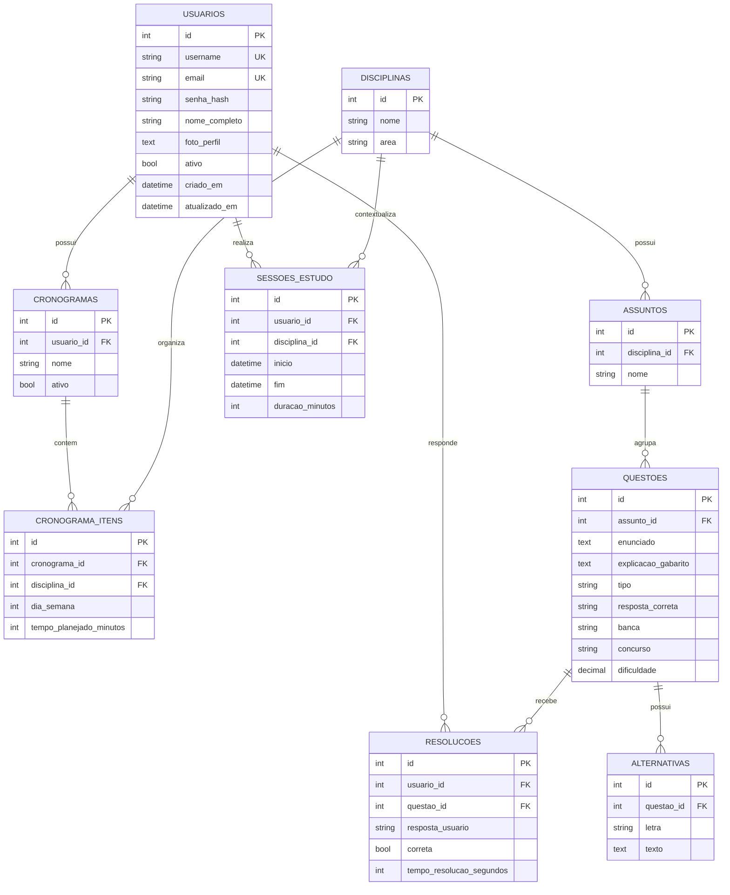

# Projeto Concurso (Cycle ORM + SQLite)

Projeto de estudo com modelagem de domínio para preparação de concursos usando PHP, Cycle ORM e SQLite.

## Requisitos

- PHP 8.2+ (recomendado 8.3)
- Composer

## Instalação

```bash
composer install
```

## Estrutura principal

- `src/Entity`: entidades do domínio
- `src/Repository`: repositórios (consultas e persistência)
- `config/orm.php`: configuração do ORM
- `sync.php`: sincroniza schema com o SQLite
- `exemplos/crud_usuario.php`: exemplo simples de CRUD
- `tests/RepositoriosSuiteTest.php`: suíte única de testes dos repositórios

## Banco de dados

O projeto usa SQLite em `runtime/database.sqlite`.

Para (re)criar/sincronizar as tabelas:

```bash
php sync.php
```

## Executando exemplo

```bash
php exemplos/crud_usuario.php
```

## Exemplos de uso (código)

### Criar e consultar usuário

```php
<?php
require_once __DIR__ . '/vendor/autoload.php';

use App\Entity\Usuario;
use App\Repository\UsuarioRepositorio;

$orm = require __DIR__ . '/config/orm.php';
$usuarios = new UsuarioRepositorio($orm);

$usuario = new Usuario();
$usuario->username = 'ana.silva';
$usuario->email = 'ana.silva@example.com';
$usuario->senha_hash = password_hash('123456', PASSWORD_BCRYPT);
$usuario->nome_completo = 'Ana Silva';

$usuarios->salvar($usuario);

$porId = $usuarios->buscarPorId($usuario->id);
$porEmail = $usuarios->buscarPorEmail('ana.silva@example.com');
$todos = $usuarios->buscarTodos();
```

### Criar disciplina, assunto e questão

```php
<?php
use App\Entity\Disciplina;
use App\Entity\Assunto;
use App\Entity\Questao;
use App\Repository\DisciplinaRepositorio;
use App\Repository\AssuntoRepositorio;
use App\Repository\QuestaoRepositorio;

$disciplinas = new DisciplinaRepositorio($orm);
$assuntos = new AssuntoRepositorio($orm);
$questoes = new QuestaoRepositorio($orm);

$disciplina = new Disciplina();
$disciplina->nome = 'Direito Constitucional';
$disciplina->area = 'Direito';
$disciplinas->salvar($disciplina);

$assunto = new Assunto();
$assunto->disciplina = $disciplina;
$assunto->nome = 'Direitos Fundamentais';
$assuntos->salvar($assunto);

$questao = new Questao();
$questao->assunto = $assunto;
$questao->enunciado = 'Texto da questão';
$questao->tipo = 'multipla_escolha';
$questao->resposta_correta = 'A';
$questoes->salvar($questao);

$daBanca = $questoes->buscarPorBanca('FGV');
$porFaixa = $questoes->buscarPorFaixaDificuldade(0.4, 0.8);
```

### Criar cronograma e item de cronograma

```php
<?php
use App\Entity\Cronograma;
use App\Entity\ItemCronograma;
use App\Repository\CronogramaRepositorio;
use App\Repository\ItemCronogramaRepositorio;

$cronogramas = new CronogramaRepositorio($orm);
$itens = new ItemCronogramaRepositorio($orm);

$cronograma = new Cronograma();
$cronograma->usuario = $usuario;
$cronograma->nome = 'Plano Semanal';
$cronograma->ativo = true;
$cronogramas->salvar($cronograma);

$item = new ItemCronograma();
$item->cronograma = $cronograma;
$item->disciplina = $disciplina;
$item->dia_semana = 1;
$item->tempo_planejado_minutos = 120;
$itens->salvar($item);

$ativos = $cronogramas->buscarAtivosPorUsuario($usuario);
```

### Criar alternativa, resolução e sessão de estudo

```php
<?php
use App\Entity\Alternativa;
use App\Entity\Resolucao;
use App\Entity\SessaoEstudo;
use App\Repository\AlternativaRepositorio;
use App\Repository\ResolucaoRepositorio;
use App\Repository\SessaoEstudoRepositorio;

$alternativas = new AlternativaRepositorio($orm);
$resolucoes = new ResolucaoRepositorio($orm);
$sessoes = new SessaoEstudoRepositorio($orm);

$alternativa = new Alternativa();
$alternativa->questao = $questao;
$alternativa->letra = 'A';
$alternativa->texto = 'Texto da alternativa A';
$alternativas->salvar($alternativa);

$resolucao = new Resolucao();
$resolucao->usuario = $usuario;
$resolucao->questao = $questao;
$resolucao->resposta_usuario = 'A';
$resolucao->correta = true;
$resolucoes->salvar($resolucao);

$sessao = new SessaoEstudo();
$sessao->usuario = $usuario;
$sessao->disciplina = $disciplina;
$sessao->inicio = new DateTimeImmutable('2026-06-01 19:00:00');
$sessao->fim = new DateTimeImmutable('2026-06-01 20:00:00');
$sessao->duracao_minutos = 60;
$sessoes->salvar($sessao);

$historico = $resolucoes->buscarPorUsuario($usuario);
$corretas = $resolucoes->buscarCorretasPorUsuario($usuario);
$periodo = $sessoes->buscarPorPeriodo(
    new DateTimeImmutable('2026-06-01 00:00:00'),
    new DateTimeImmutable('2026-06-30 23:59:59')
);
```

## Executando testes

```bash
php tests/RepositoriosSuiteTest.php
```

Observação: a suíte usa banco SQLite temporário isolado por teste para evitar lock de arquivo.

## Repositórios disponíveis

- `UsuarioRepositorio`
- `CronogramaRepositorio`
- `ItemCronogramaRepositorio`
- `DisciplinaRepositorio`
- `AssuntoRepositorio`
- `QuestaoRepositorio`
- `AlternativaRepositorio`
- `ResolucaoRepositorio`
- `SessaoEstudoRepositorio`

## Diagrama do banco (Mermaid)



## Notas

- No SQLite, `string` com `length` é útil para modelagem, mas o tamanho não é rigidamente imposto sem `CHECK`.
- Unicidade de usuário está garantida por índices únicos em `username` e `email`.
