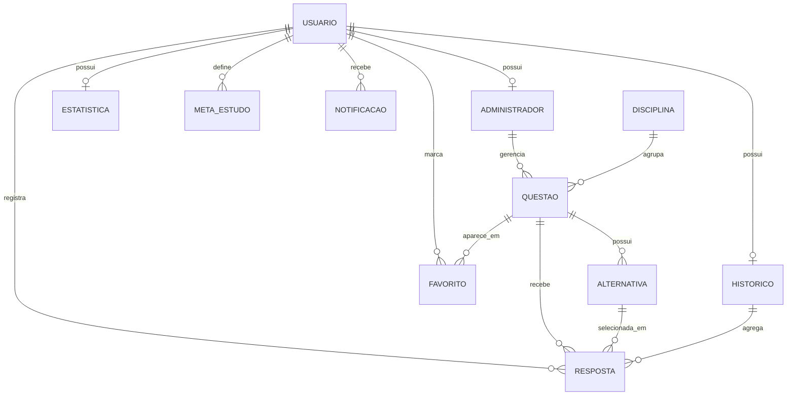
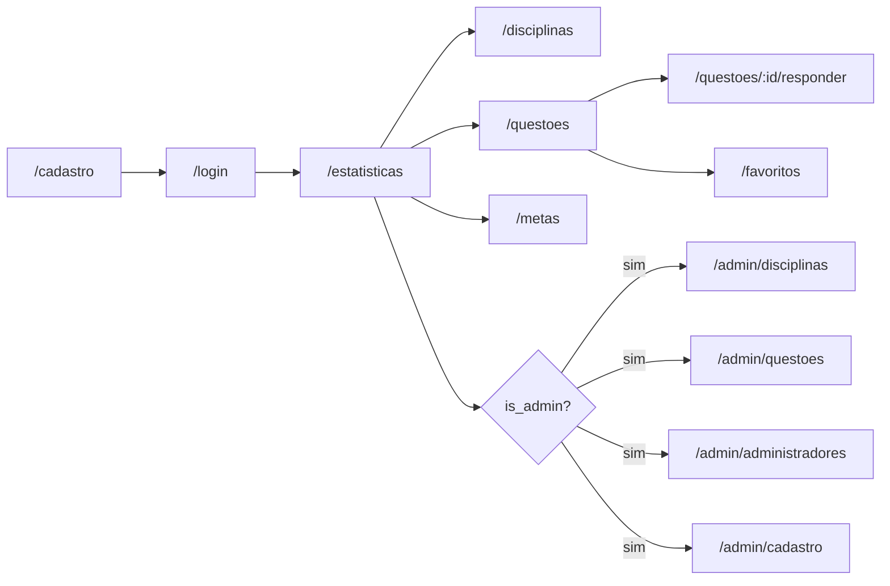

# O Monitor

Aplicação de estudos com API FastAPI e interface React para cadastro de usuários, resolução de questões, favoritos, metas diárias, acompanhamento de desempenho e administração de conteúdo.

## Visão geral

- **Backend**: FastAPI, SQLModel, SQLite, Alembic, autenticação JWT e testes com Pytest.
- **Frontend**: React, TypeScript, Vite, React Router, Axios e `lucide-react`.
- **Banco local**: `database.sqlite`, configurado em `app/database.py` e `alembic.ini`.
- **Notebooks**: `notebooks/` contém notebooks Marimo para popular dados e demonstrar fluxos.

## Estrutura

```text
app/
  main.py              # aplicação FastAPI e registro dos routers
  database.py          # engine SQLModel e sessão por request
  models/              # tabelas SQLModel e enums de domínio
  schemas/             # modelos Pydantic de entrada e saída
  services/            # regras de negócio
  routers/             # endpoints HTTP
  dependencies/        # autenticação e autorização
frontend/
  src/                 # aplicação React
  public/              # logos e assets públicos
migrations/
  versions/            # revisões Alembic
notebooks/             # notebooks Marimo de seed e demonstração
tests/                 # testes unitários e de serviços
```

## Requisitos

- Python `>=3.14`
- `uv`
- Node.js e npm

## Instalação

Instale as dependências do backend:

```bash
uv sync
```

Instale as dependências do frontend:

```bash
cd frontend
npm install
```

## Banco de dados

Crie ou atualize o banco SQLite local com Alembic:

```bash
uv run alembic upgrade head
```

A URL padrão é `sqlite:///./database.sqlite`. O backend usa esse arquivo em execução normal; os testes usam SQLite em memória e não escrevem em `database.sqlite`.

### Estrutura do banco

As tabelas principais são:

- `usuario`: conta da plataforma, com e-mail único, senha em hash, data de cadastro e status ativo.
- `administrador`: perfil administrativo vinculado a um único usuário.
- `disciplina`: área de estudo usada para agrupar questões.
- `questao`: enunciado, assunto, ano, dificuldade, explicação e vínculos com disciplina e administrador.
- `alternativa`: alternativas de uma questão, com marcação da alternativa correta.
- `resposta`: tentativa de resolução de uma questão por um usuário.
- `historico`: totais agregados de respostas, acertos e erros por usuário.
- `estatistica`: estatísticas calculadas de desempenho por usuário.
- `meta_estudo`: metas de quantidade de questões e tempo diário por usuário.
- `favorito`: questões favoritadas por usuário, com par usuário/questão único.
- `notificacao`: mensagens enviadas para usuários, como lembretes ou metas concluídas.



## Executando o app

Suba a API em um terminal:

```bash
uv run uvicorn app.main:app --reload
```

A API ficará em `http://127.0.0.1:8000`:

- `GET /` retorna o status básico.
- `GET /docs` abre a documentação Swagger.
- `GET /redoc` abre a documentação ReDoc.

Suba o frontend em outro terminal:

```bash
cd frontend
npm run dev
```

O frontend Vite roda por padrão em `http://localhost:5173` e consome a API em `http://127.0.0.1:8000`.

## Fluxo de uso

1. Acesse `/cadastro` no frontend e crie um usuário.
2. O primeiro usuário cadastrado recebe perfil de administrador automaticamente.
3. Entre em `/login`; o token JWT é salvo no `localStorage` e o frontend verifica se o usuário autenticado é administrador.
4. Usuários autenticados usam as páginas comuns para consultar disciplinas, responder questões, salvar favoritos, definir metas e acompanhar o dashboard de desempenho.
5. Administradores acessam as páginas `/admin/disciplinas`, `/admin/questoes`, `/admin/administradores` e `/admin/cadastro` para funções administrativas.
6. Administradores podem promover apenas usuários já cadastrados, informando o e-mail do usuário.

## Páginas da aplicação

Páginas públicas:

- `/login`: autentica usuário e grava `access_token`, `usuario` e `is_admin` no `localStorage`.
- `/cadastro`: cria uma conta. O primeiro usuário cadastrado ganha perfil administrador automaticamente.

Páginas autenticadas:

- `/estatisticas`: dashboard de desempenho com percentual de acerto, respondidas, acertos e erros.
- `/disciplinas`: lista disciplinas disponíveis.
- `/questoes`: lista questões, permite responder e favoritar.
- `/questoes/:id/responder`: exibe alternativas e mostra resultado verde para acerto e vermelho para erro.
- `/metas`: cria, lista e remove metas de estudo.
- `/favoritos`: lista questões favoritas pelo enunciado, com ações de ver e remover.

Páginas administrativas:

- `/admin/disciplinas`: cadastra disciplinas.
- `/admin/questoes`: cadastra questões e alternativas.
- `/admin/administradores`: lista administradores e promove usuários por e-mail.
- `/admin/cadastro`: formulário dedicado para promover usuário existente a administrador por e-mail.



## Usuários e administradores

Todo usuário cadastrado pode autenticar, acessar o dashboard de desempenho, consultar disciplinas e questões, responder questões, favoritar questões e gerenciar metas de estudo.

O primeiro usuário criado no banco vira administrador por padrão, sem precisar passar por uma tela de bootstrap. Após esse primeiro cadastro, novos usuários entram como usuários comuns.

Administradores mantêm todos os recursos de usuário comum e também podem:

- cadastrar disciplinas;
- cadastrar e remover questões;
- listar administradores;
- promover usuários existentes a administradores por e-mail;
- enviar notificações para usuários pela API.

As rotas administrativas exigem JWT válido e perfil de administrador confirmado por `/administradores/me`. Usuários comuns não veem os links administrativos no menu e são redirecionados ao tentar acessar rotas admin no frontend.

## Principais endpoints

- `POST /usuarios`: cadastra usuário.
- `POST /auth/login`: autentica via formulário OAuth2 e retorna JWT.
- `GET /auth/me`: retorna o usuário autenticado.
- `GET /administradores/me`: verifica se o usuário autenticado é administrador.
- `GET /administradores`: lista administradores, restrito a administradores.
- `POST /administradores`: promove usuário existente por e-mail, restrito a administradores.
- `GET /administradores/cadastro-disponivel`: informa se o usuário autenticado pode acessar promoção de administradores.
- `GET /disciplinas` e `GET /disciplinas/{id}`: consulta disciplinas.
- `POST /disciplinas`: cadastra disciplinas, restrito a administradores.
- `GET /questoes` e `GET /questoes/{id}`: consulta questões.
- `POST /questoes` e `DELETE /questoes/{id}`: cadastra e remove questões, restrito a administradores.
- `POST /respostas` e `POST /respostas/{id}/responder`: inicia e corrige resolução.
- `GET /favoritos/me`, `POST /favoritos`, `DELETE /favoritos`: gerencia favoritos do usuário autenticado.
- `GET /metas-estudo/me`, `POST /metas-estudo`, `PATCH /metas-estudo/{id}` e `DELETE /metas-estudo/{id}`: lista, cria, edita e remove metas de estudo.
- `GET /estatisticas/me`: calcula estatísticas do usuário autenticado.
- `POST /notificacoes`: envia notificação, restrito a administradores.
- `GET /notificacoes/usuario/{usuario_id}` e `PATCH /notificacoes/{id}/lida`: consulta e marca notificações.

## Testes e qualidade

Execute a suíte de testes:

```bash
uv run pytest -q
```

Execute verificação estática do backend:

```bash
uv run pyright
```

Execute lint do backend:

```bash
uv run ruff check
```

Execute validações do frontend:

```bash
cd frontend
npm run lint
npm run build
```
