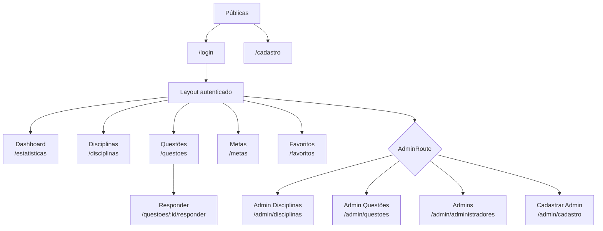

# Frontend do O Monitor

Interface web do O Monitor, construída com React, TypeScript e Vite. A aplicação consome a API FastAPI do repositório e oferece telas para autenticação, dashboard, disciplinas, questões, resolução, metas, favoritos e administração de conteúdo.

## Stack

- React `19`
- TypeScript
- Vite
- React Router
- Axios
- ESLint

## Estrutura

```text
src/
  api/api.ts              # cliente Axios e injeção do token JWT
  components/             # layout, navegação, botões, cards e guards de rota
  pages/                  # telas comuns do usuário
  pages/admin/            # telas restritas a administradores
  types/index.ts          # tipos compartilhados com a API
  App.tsx                 # definição das rotas
```

## Configuração da API

O cliente HTTP está em `src/api/api.ts` e usa:

```ts
baseURL: "http://127.0.0.1:8000"
```

Antes de usar o frontend, suba o backend na raiz do repositório:

```bash
uv run uvicorn app.main:app --reload
```

O backend libera CORS para `http://localhost:5173` e `http://127.0.0.1:5173`.

## Instalação

```bash
npm install
```

## Desenvolvimento

```bash
npm run dev
```

O Vite normalmente serve a aplicação em `http://localhost:5173`.

## Rotas da aplicação

- `/login`: autenticação do usuário.
- `/cadastro`: criação de conta.
- `/disciplinas`: listagem de disciplinas.
- `/questoes`: catálogo de questões, ação de favoritar e acesso para responder.
- `/questoes/:id/responder`: resolução de uma questão; o resultado fica verde quando correto e vermelho quando incorreto.
- `/metas`: definição, listagem e remoção de metas diárias.
- `/favoritos`: questões favoritas do usuário, exibidas pelo enunciado, com ações de ver e remover.
- `/estatisticas`: dashboard de desempenho.
- `/admin/cadastro`: promoção de usuário existente a administrador por e-mail.
- `/admin/disciplinas`: cadastro administrativo de disciplinas.
- `/admin/questoes`: cadastro administrativo de questões e alternativas.
- `/admin/administradores`: gestão de administradores.

As rotas internas são protegidas por `ProtectedRoute`, que verifica `access_token` no `localStorage`. Todas as rotas administrativas passam por `AdminRoute`, que exige `is_admin=true`.

## Perfis de acesso

O primeiro usuário cadastrado na API vira administrador automaticamente. Usuários cadastrados depois disso entram como usuários comuns.

Usuários comuns podem acessar:

- dashboard de desempenho;
- listagem de disciplinas;
- catálogo e resolução de questões;
- favoritos;
- metas;

Administradores podem acessar tudo que um usuário comum acessa e também:

- cadastrar disciplinas em `/admin/disciplinas`;
- cadastrar questões em `/admin/questoes`;
- consultar a lista de administradores em `/admin/administradores`;
- promover usuários existentes por e-mail em `/admin/cadastro`.

O menu lateral mostra links administrativos apenas quando `is_admin` está salvo como `true` após a verificação de `/administradores/me` no login.

## Mapa das páginas



## Comportamento por tela

- **Dashboard**: consome `/estatisticas/me` e mostra percentual de acerto, respondidas, acertos e erros.
- **Disciplinas**: consome `/disciplinas` e mostra as áreas cadastradas.
- **Questões**: consome `/questoes`, permite favoritar com mensagem de sucesso/erro e abre a resolução.
- **Responder**: cria uma tentativa em `/respostas`, envia a alternativa selecionada e exibe explicação da questão.
- **Metas**: consome `/metas-estudo/me`, cria metas em `/metas-estudo` e remove com `DELETE /metas-estudo/{id}`.
- **Favoritos**: consome `/favoritos/me`, mostra o enunciado da questão e remove com `DELETE /favoritos?questao_id=...`.
- **Admin Disciplinas**: cria disciplinas com `POST /disciplinas`.
- **Admin Questões**: cria questões com alternativas usando `POST /questoes`.
- **Admins/Cadastrar Admin**: lista administradores e promove usuários existentes com `POST /administradores`.

## Sessão

Após o login:

- `access_token` guarda o JWT retornado por `/auth/login`.
- `usuario` guarda os dados retornados por `/auth/me`.
- `is_admin` guarda se `/administradores/me` confirmou perfil administrativo.
- O interceptor do Axios envia `Authorization: Bearer <token>` em todas as requisições autenticadas.
- O logout remove esses dados do `localStorage`.

## Scripts

```bash
npm run dev      # servidor de desenvolvimento
npm run build    # type-check e build de produção
npm run lint     # lint do projeto
npm run preview  # preview local do build
```

## Build

```bash
npm run build
```

O build é gerado em `dist/`.
