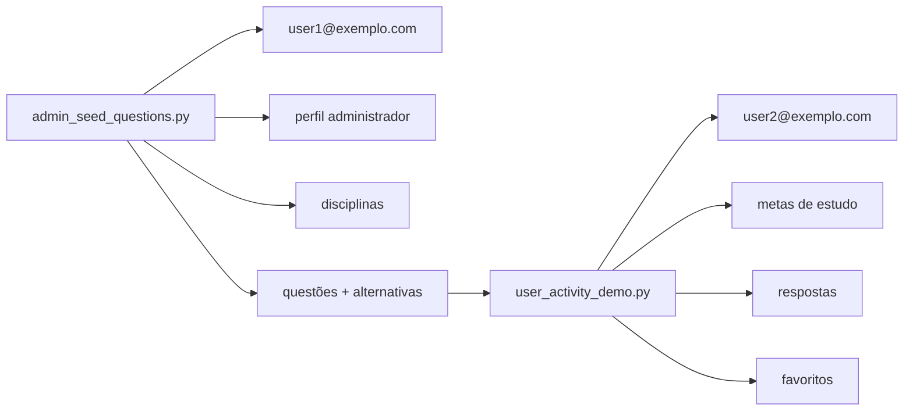

# Notebooks Marimo

Este diretório contém notebooks para popular o banco local `database.sqlite` e demonstrar fluxos da aplicação sem precisar operar tudo pela interface web.

## Como executar

Na raiz do repositório:

```bash
uv run marimo edit notebooks/admin_seed_questions.py
uv run marimo edit notebooks/user_activity_demo.py
```

Os notebooks usam os serviços Python da aplicação e gravam no mesmo banco SQLite configurado em `app/database.py`.

## Ordem recomendada

1. Execute `admin_seed_questions.py` para garantir o administrador e cadastrar questões de exemplo.
2. Execute `user_activity_demo.py` para garantir o usuário comum e simular metas, respostas e favoritos.

## Notebooks disponíveis

### `question_registration.py`

Notebook inicial de registro de questões. Atualmente funciona como esqueleto Marimo e referência para novas células.

### `admin_seed_questions.py`

Credenciais usadas:

- E-mail: `user1@exemplo.com`
- Senha: `1234`

O notebook:

- cria ou atualiza o usuário administrador;
- garante que esse usuário tenha perfil em `administrador`;
- cadastra disciplinas de exemplo;
- cadastra questões genéricas com alternativas;
- ignora questões já existentes pelo mesmo enunciado.

### `user_activity_demo.py`

Credenciais usadas:

- E-mail: `user2@exemplo.com`
- Senha: `1234`

O notebook:

- cria ou atualiza o usuário comum;
- cadastra metas de estudo;
- responde algumas questões disponíveis;
- favorita questões;
- reaproveita metas/favoritos já existentes quando possível.

## Dados gerados



## Observações

- Os notebooks são idempotentes para uso local: rodar novamente não deve duplicar usuários, questões com o mesmo enunciado ou favoritos iguais.
- O notebook do usuário depende de haver questões no banco. Se nenhuma questão existir, execute primeiro o notebook administrativo.
- As senhas informadas são senhas de exemplo para ambiente local.
